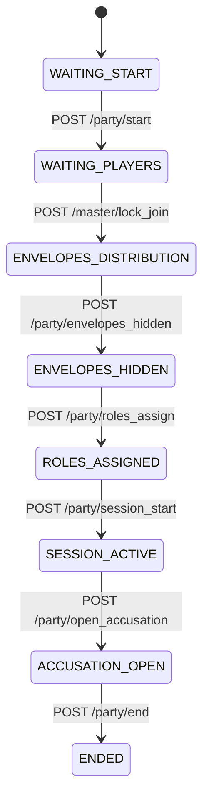
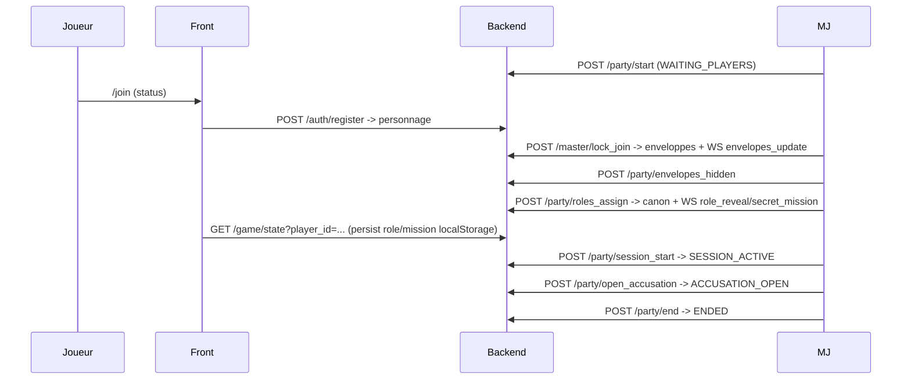

# MurderParty – Frontend Next.js

Interface joueur & Maître de Jeu pour notre murder party. Next.js 14 (App Router), Tailwind CSS, Zustand, WebSocket natif.
**Langue par défaut : français. Spoilers masqués côté MJ/Joueur par défaut.**

---

## ?? Installation & scripts

| Étape | Commande |
|-------|---------|
| Installer | `npm install` |
| Copier l’environnement | `cp .env.example .env.local` |
| Lancer le dev server | `npm run dev` |
| Build prod | `npm run build && npm run start` |
| Linter *(ajouter ESLint avant)* | `npm run lint` |

> Serveur Next : http://localhost:3000 • Node = 18 (CI utilise Node 20).

---

## ?? Variables d’environnement

| Variable | Description | Exemple |
|----------|-------------|---------|
| `NEXT_PUBLIC_API_BASE` | Base REST FastAPI | `http://localhost:8000` |
| `NEXT_PUBLIC_WS_URL` | URL WebSocket (convertie en ws://) | `http://localhost:8000` |
| `MJ_SECRET` *(optionnel)* | Secret build-time MJ | `change-me` |

---

## ?? Routing applicatif

| Route | Rôle | Description |
|-------|------|-------------|
| `/` | Public | Accueil |
| `/join` | Joueur | Inscription / statut inscriptions |
| `/room/[playerId]` | Joueur | Salle privée : flux, indices, enveloppes, rôle/mission |
| `/mj/login` | MJ | Authentifie le MJ (cookie HttpOnly) |
| `/mj/dashboard` | MJ | Contrôles, canon (spoiler), joueurs, journal |

---

## ?? WebSocket – événements

| Événement | Payload JSON | Émetteur ? Récepteur | Quand ? |
|-----------|--------------|----------------------|---------|
| `ws:open / ws:close / ws:error` | `null` | Socket interne | Lifecycle client |
| `identified` | `{ player_id }` | Serveur ? Joueur | Après `identify` |
| `event` | `{ kind, ... }` | Serveur ? Tous | Broadcast générique |
| `event:phase_change` | `{ kind:"phase_change", phase }` | Serveur ? Tous | Changement de phase |
| `event:envelopes_update` | `{ kind:"envelopes_update", player_id?, envelopes? }` | Serveur ? Joueur ciblé / broadcast | Enveloppes redistribuées |
| `clue` | `{ text, kind }` | Serveur ? Joueur ciblé | Indice privé |
| `role_reveal` | `{ role }` | Serveur ? Joueur ciblé | Attribution rôle |
| `secret_mission` | `{ title, text }` | Serveur ? Joueur ciblé | Mission secrète |

*(Plus de détails : voir `/docs/EVENTS.md`.)*

---

## ?? How it works

### Machine à états (backend – as-is)

### Séquence de partie

---

## ? Bonnes pratiques front

1. **Spoilers** : afficher canon / rôle / mission uniquement via toggles locaux (pas de fuite backend).
2. **localStorage** : conserver `mp_role`, `mp_mission`, `player_id` uniquement. Nettoyer au logout.
3. **Temps réel** : passer par `lib/socket.ts`; resynchroniser après reconnect via `api.getGameState`.
4. **Sécurité MJ** : cookie HttpOnly (`/auth/mj/login`). Aucun secret dans le bundle.
5. **Tests manuels** : suivre `docs/tests-lotB.md` (canon ? enveloppes ? rôles ? mission). Vérifier événements `ws_role_reveal_sent` / `ws_mission_sent`.

---

## ?? Dossiers

- `app/` – pages Next.js (CSR actuellement)
- `components/` – UI (MJ/Joueur)
- `lib/api.ts` – client REST
- `lib/socket.ts` – wrapper WebSocket
- `lib/store.ts` – Zustand
- `styles/` – Tailwind
- `.env.example` – gabarit env

---

## ?? CI

Workflow GitHub Actions (`.github/workflows/ci-frontend.yml`) :
1. `npm ci`
2. `npm test --if-present`
3. `npm run build --if-present`

?? Ajouter `npm run lint` une fois ESLint configuré (`next lint`).

---

## ?? Roadmap & TODO

Kanban détaillé dans `/docs/TODO_FRONTEND.md` (Done / En cours / Next / Backlog).
