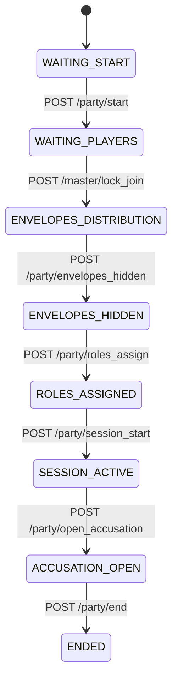
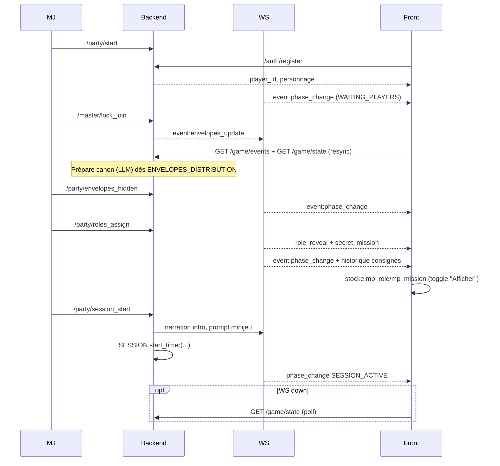

# Flux de jeu – As-is & To-be

## As-is
### Joueur
1. `/join` (statut) ? `POST /auth/register`.
2. `/room/[playerId]` :
   - `GET /game/events?player_id=...` (historique partagé, max 200 entrées).
   - `GET /game/state` (snapshot).
   - WS `identify`, écoute `event:*`, `clue`, `role_reveal`, `secret_mission`, resync REST à la reconnexion, fallback poll 15 s.
3. Rôle/mission : `localStorage` + toggles anti-spoiler.

### MJ
1. `/mj/login` (cookie).
2. `/mj/dashboard` : actions `start`, `lock_join`, `envelopes_hidden`, `roles_assign`.
3. Canon spoiler toggle, joueurs (enveloppes + rôle toggle), journal. WS broadcast.

### Phases globales
- WAITING_START ? WAITING_PLAYERS ? ENVELOPES_DISTRIBUTION ? ENVELOPES_HIDDEN ? ROLES_ASSIGNED ? SESSION_ACTIVE ? ACCUSATION_OPEN ? ENDED.
- `roles_assign` : canon + missions, logs `ws_role_reveal_sent`, `ws_mission_sent`.

#### Diagramme état (as-is)

---

## To-be
### Améliorations
- Générer le canon dès ENVELOPES_DISTRIBUTION (préload).
- `/party/session_start` :
  - Intro LLM (WS `narration`).
  - `SESSION.start_next_round()` (minijeu, prompts).
  - Timer (`start_timer` ? `narration half_time`, `timer_end`).
- Résilience WS : backoff exponentiel, buffer + resync REST.
- Accessibilité : focus, ARIA, avatars `aria-hidden`.
- Sécurité : cookie MJ, pas de secrets dans bundle, logs filtrés.
- UX : toggles spoiler pour rôle/mission, skeleton.

#### Diagramme séquence (to-be)

